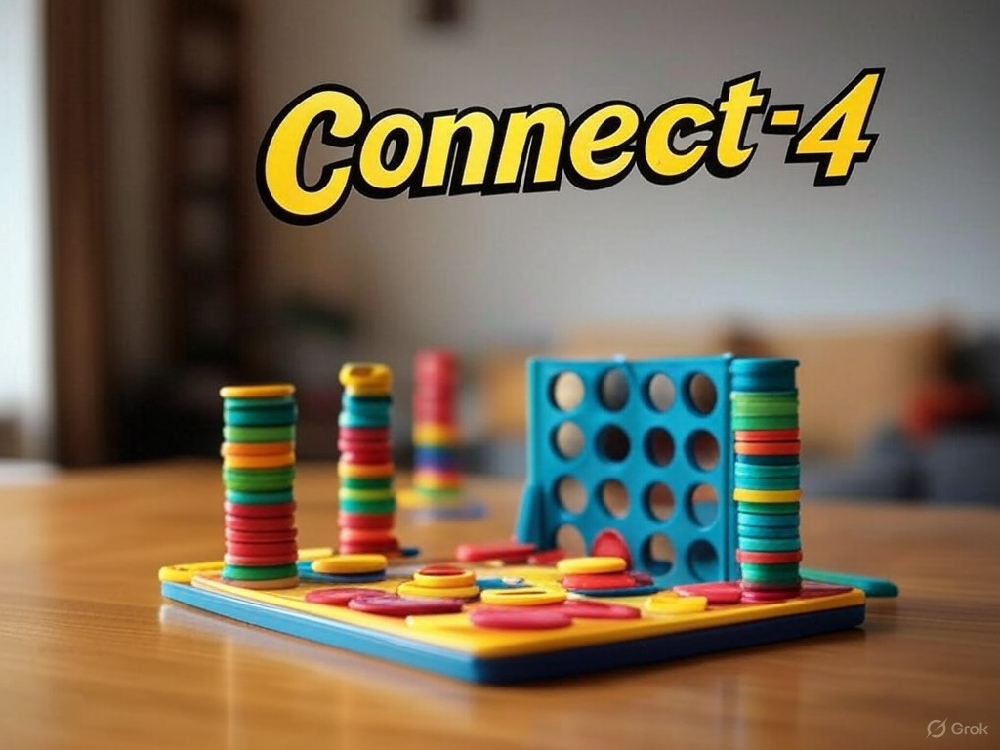

# Conecta 4 - Proyecto Web

¡Bienvenido al proyecto de Conecta 4! Este es un juego clásico implementado como una aplicación web interactiva usando HTML, CSS y JavaScript. El objetivo es alinear cuatro fichas de tu color (rojo o azul) en horizontal, vertical o diagonal antes que tu oponente. ¡Diviértete jugando y comparte tu creación con otros!

### Descripción del Juego

Conecta 4 es un juego de mesa para dos jugadores que se juega en un tablero vertical de 6 filas y 7 columnas. Los jugadores alternan turnos dejando caer fichas de su color en una columna, y la ficha cae hasta la posición más baja disponible. El primer jugador en conectar cuatro fichas de su color en una línea (horizontal, vertical o diagonal) gana. Si el tablero se llena sin un ganador, el juego termina en empate.

### Características

Turnos indicados con botones resaltados (rojo o azul).
Resaltado visual de la jugada ganadora con animación.
Anuncio vistoso del ganador o empate.
Diseño moderno con animaciones y efectos interactivos.
Compatible con GitHub Pages para jugar directamente en el navegador.

### Cómo Jugar

Visita el sitio web en (sitio en construccion) 

Haz clic en una columna para soltar tu ficha (rojo empieza).
Alterna turnos con el otro jugador hasta conectar cuatro fichas o llenar el tablero.
¡Disfruta del anuncio del ganador o reinicia para una nueva partida!

### Tecnologías Utilizadas

HTML: Estructura del tablero y la interfaz.
CSS: Estilizado con animaciones y diseño responsivo.
JavaScript: Lógica del juego, detección de victorias y manejo de interacciones.
Instalación

No necesitas instalar nada para jugar. Solo sube los archivos (index.html, conecta.js, style.css) a un repositorio de GitHub y activa GitHub Pages en la sección de configuración del repositorio. ¡Listo!

### Contribuciones

Si quieres mejorar el juego (añadir un modo contra IA, sonidos, etc.), ¡siéntete libre de hacer un fork y enviar un pull request!

### Licencia

Este proyecto está bajo la licencia MIT. Usa, modifica y comparte como quieras, pero siempre incluye la licencia.

### Autor

Creado por @cervereta con la ayuda de Grok 3 de xAI.